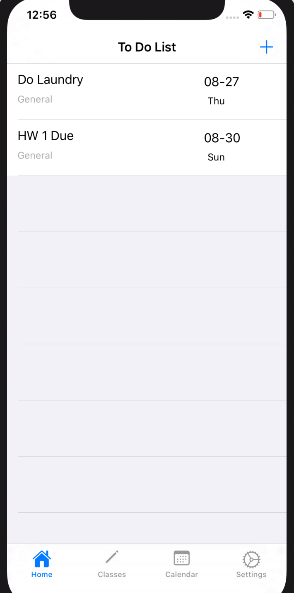
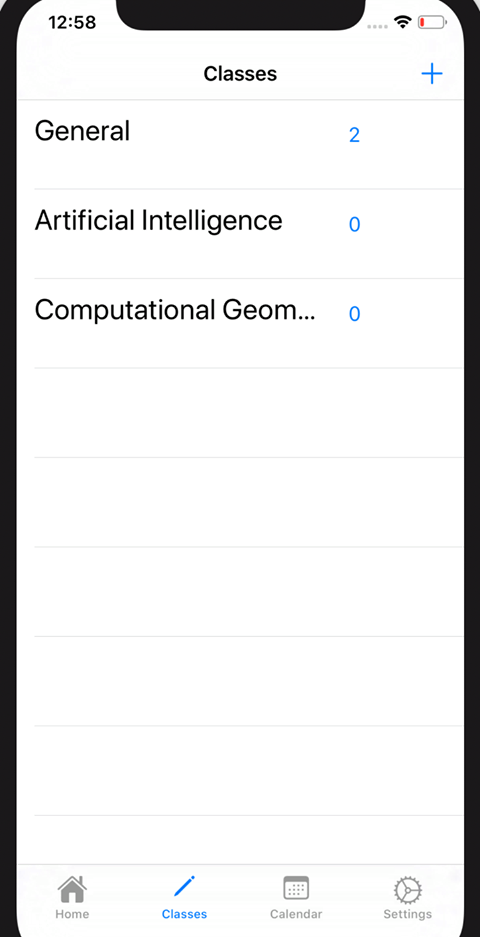
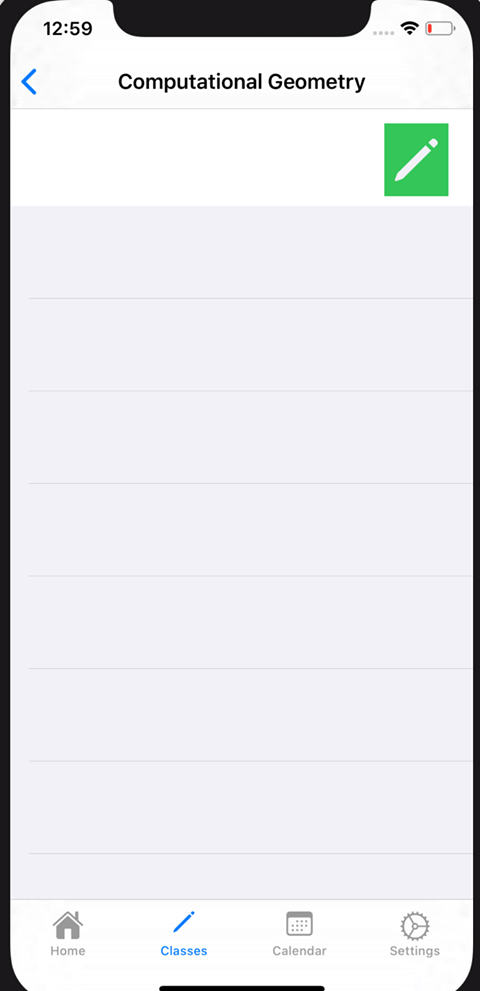
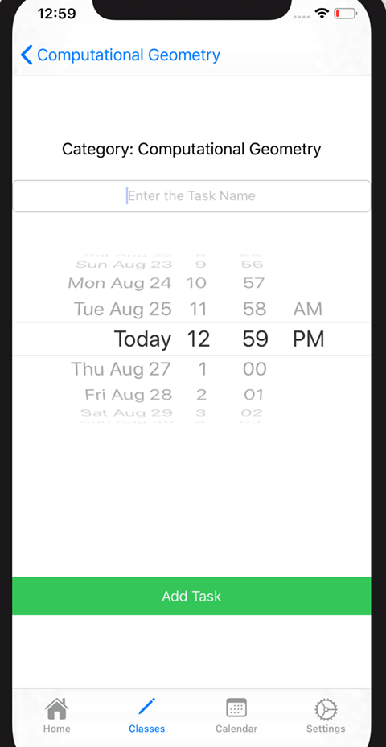
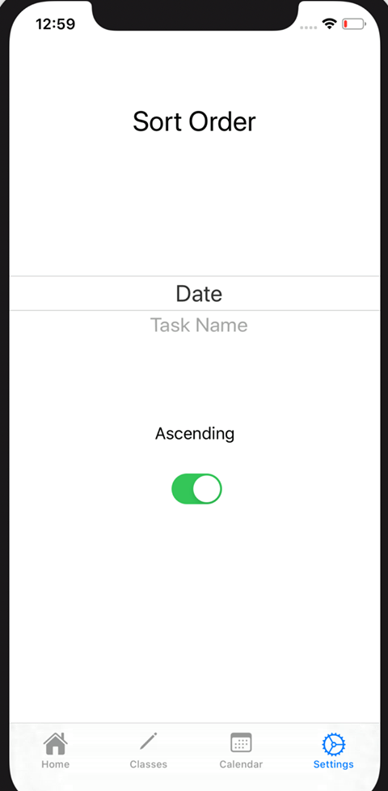

# iOS-Planner
Developer: Jason Huang

iOS-Planner is a simple planner that allows you keep track of your tasks.

# Current Features
  - Auto deletion of task when deadline has passed
  - Alert when a task will hit the deadline
  - Add and remove tasks within a specific category
  - Add and remove categories / classes
  - Sort tasks based on name or date.

#### The Layout

The navigation bar is on the bottom which allows users to switch between sections of the application. Hit the '+' button in home to add a general task and swipe left on the task to remove a task.

***
#### Classes / Categories

The '+' button allows you to create a new class / category. Swiping left on a class will prompt to delete the entire class along with the tasks associated to the class. Tapping on a class will allow you to see all of the tasks pertaining to the class.
***
#### Classes Editting

Once you click on a class, this is the screen that you will see. The green edit button will allow you to create a new task within that class. 

You will subsequently be prompted to enter a task name and a date. 

***
#### Sorting

In this tab, you will have the opportunity to sort the tasks in either your class task view or in home (where you can see all of your current tasks). 
